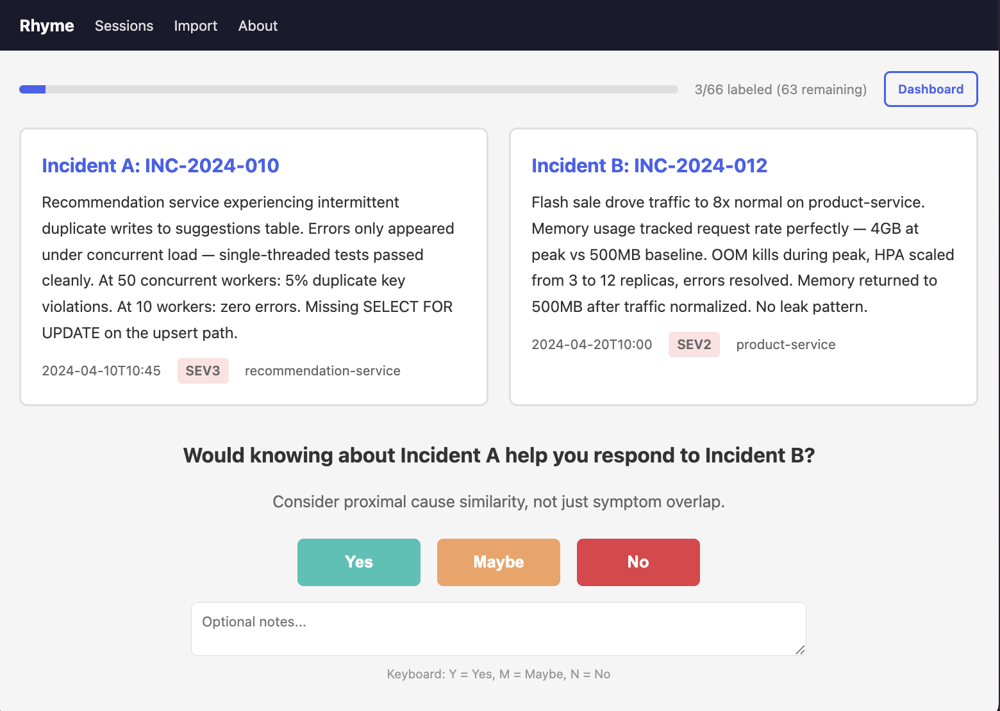
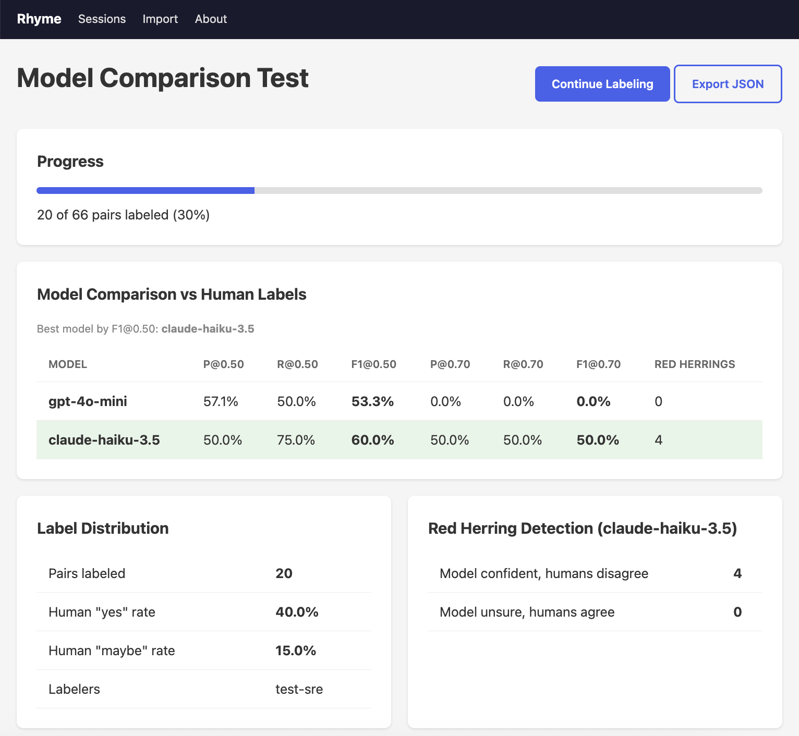

# Rhyme

**A benchmark for evaluating how well LLMs correlate incidents by proximal cause — not just by symptoms.**

When an "AI SRE" tool surfaces a similar past incident, is it actually helpful — or is it a red herring? Incidents often share symptoms (same error codes, same affected services) while having completely different underlying causes. Surfacing the wrong one sends the on-call engineer down the wrong path.

Rhyme measures whether a model can tell the difference. You can find the full paper [here](https://github.com/jeffcampbell/rhyme/blob/main/paper/Rhyme-Paper.pdf).

## Rhyme Scores

| Model | Precision@10 | ECE | Tokens/query | Correct fix | Would worsen |
|-------|-------------|-----|-------------|------------|-------------|
| Phi-4 | **0.825** | 0.101 | 1,876 | 94% | 3% |
| GPT-4.1 nano | 0.818 | **0.037** | 1,875 | 90% | 0% |
| Nemotron 3 Super 120B (free)‡ | 0.813 | 0.146 | 4,981 | 91% | 1% |
| GPT-4o | 0.811 | 0.105 | 1,879 | 95% | 0% |
| Claude Sonnet 4.5 | 0.807 | 0.114 | 2,185 | 93% | 0% |
| Ministral 3B | 0.806 | 0.121 | 2,338 | 90% | 0% |
| Muse Glimmer 30B | 0.806 | 0.185 | 7,387 | 96% | 0% |
| Gemini 2.5 Flash | 0.805 | 0.102 | 2,307 | 94% | 0% |
| DeepSeek V3 | 0.804 | 0.115 | 1,933 | 72% | 4% |
| GPT-5.6 Luna | 0.804 | 0.138 | 2,421 | 94% | 0% |
| Claude Sonnet 5 | 0.804 | 0.165 | 3,727 | **98%** | 0% |
| GPT-4o mini | 0.802 | 0.082 | 1,879 | 95% | 1% |
| Claude Sonnet 4 | 0.802 | 0.091 | 2,186 | 94% | 0% |
| GPT-5.6 Sol | 0.801 | 0.157 | 2,257 | **98%** | 0% |
| Gemini 3.7 Flash | 0.799 | 0.112 | 3,518 | 96% | 0% |
| GPT-4.1 | 0.799 | 0.150 | 1,877 | 93% | 0% |
| Inkling | 0.799 | 0.147 | 9,204 | 94% | 0% |
| Qwen3.8 27B* | 0.798 | 0.116 | 2,144 | 93% | 0% |
| Claude Fable 5 | 0.795 | 0.115 | 3,397 | 95% | 0% |
| Gemma 4 31B IT | 0.792 | 0.160 | 2,318 | 94% | 0% |
| Bonsai 27B (local)† | 0.791 | 0.132 | 2,123 | 72% | 4% |
| Gemini 2.0 Flash | 0.789 | 0.132 | 2,243 | 89% | 0% |
| Claude Haiku 3.5 | 0.784 | 0.106 | 2,186 | 94% | 0% |
| Gemma 4 26B A4B IT (free)‡ | 0.784 | 0.106 | 2,308 | 95% | 0% |
| Kimi K3 | 0.783 | 0.117 | 4,729 | **98%** | 0% |
| Claude Opus 4 | 0.782 | 0.119 | 2,163 | 96% | 0% |
| Gemma 4 26B A4B QAT (local)† | 0.781 | 0.098 | 2,881 | 94% | 0% |
| Nemotron 3 Nano 4B (local)† | 0.758 | 0.162 | 2,234 | 83% | 0% |
| DeepSeek V4 Flash | 0.726 | 0.115 | 8,152 | 92% | 0% |
| DeepSeek R1 | 0.655 | 0.123 | 6,264 | 85% | 0% |
| BM25 (baseline) | 0.805 | 0.127 | 0 | — | — |
| Random (floor) | 0.037 | 0.461 | 0 | 16% | 9% |

*Precision@10: fraction of top-10 matches sharing the same proximal cause. ECE: calibration error (lower = more trustworthy confidence scores). Correct fix: chose the right remediation from 5 options. Would worsen: chose a remediation that would make things worse.*

*‡Nemotron 3 Super 120B and Gemma 4 26B A4B IT were run on OpenRouter's free tier rather than a paid endpoint — free-tier serving can differ in quantization or routing from a paid deployment of the same model, so treat these two rows as directional. They're the only free-tier models in this table; several others were attempted and dropped after failing to complete a full run due to free-tier rate limits and provider errors.*

*\*Qwen3.8 27B was run with reasoning disabled (OpenRouter `reasoning: {enabled: false}`). Left at its default thinking mode it burns ~9,600 output tokens per retrieval query with no precision benefit; the other reasoning models here (Kimi K3, Inkling) were left at their default reasoning, so treat this row as a non-thinking configuration rather than strictly comparable to them.*

*†Bonsai 27B, Gemma 4 26B A4B QAT, and Nemotron 3 Nano 4B were run on a local LM Studio server (fanless M-series MacBook) rather than a hosted endpoint — treat these as directional, local configurations. Bonsai and Gemma QAT ship a thinking chat template that makes a full local run impractically slow (~90s/retrieval query), so both were run with reasoning disabled (`reasoning_effort: none`); Nemotron 3 Nano is a non-reasoning instruct model and needed no such change. The Gemma row is a local 4-bit quantization-aware-trained (QAT) build, distinct from the free-tier Gemma 4 26B A4B IT row above.*

**Key findings:** Consistent with the standard RAG two-stage pattern, BM25 keyword retrieval matches LLM retrieval precision (~0.80) for incident correlation — confirming that expensive full-corpus LLM retrieval doesn't add value at the retrieval stage. The real value of LLMs is in reasoning: remediation accuracy jumps from 16% (random) to 72-98% when models evaluate candidates. GPT-4.1 nano has the best calibration at the lowest token cost. Two efficient open models stand out this round: Phi-4 (14B) posts the single highest retrieval precision in the whole table (0.825), and about the lowest token cost — but with a 2.5% would-worsen rate, a safety cost the top-line number hides. Ministral 3B is the more striking efficiency result: a 3B model reaching 0.806 precision (confirmed stable across three independent runs, 0.802-0.809) with 90% correct fixes and zero harmful ones — GPT-4o-class retrieval at a fraction of the size and cost. The sharpest illustration of how little reasoning spend buys: Muse Glimmer 30B, a heavy reasoner burning 7,387 tokens/query, lands the *exact same* 0.806 precision as Ministral 3B — a 3B model using ~25x fewer tokens — for no measurable correlation edge. GPT-5.6 Sol, Claude Sonnet 5, and Kimi K3 tie for the highest remediation accuracy (98%), narrowly ahead of Claude Opus 4 (96%). DeepSeek V3 is competitive on retrieval but weaker on remediation (72% correct, 4% harmful). Inkling, Muse Glimmer 30B, and Kimi K3 are notably token-hungry (9,204, 7,387, and 4,729 tokens/query) without a precision or remediation edge over cheaper models — all spend the bulk of their budget on hidden reasoning tokens before answering. DeepSeek V4 Flash is the same pattern taken further: at 8,152 tokens/query it is the second most expensive model in the table, yet its precision (0.726) trails the ~0.80 pack — a heavy reasoner that pays a precision penalty rather than earning one, and needs a large output budget to avoid truncating its answer entirely. Nemotron 3 Super 120B (free) posts near-top precision, but with 1% would-worsen — one of only a handful of hosted models this round (alongside Phi-4 and DeepSeek V3) with a nonzero harmful-fix rate.

**Local models (run via LM Studio):** Three models were benchmarked against a local LM Studio server on a fanless M-series MacBook rather than a hosted endpoint. Two of them (Bonsai 27B, Gemma 4 26B A4B QAT) ship a "thinking" chat template that, left on, makes a full run impractically slow on this hardware (~90s per retrieval query, most of it spent on hidden reasoning) — so both were run with reasoning disabled (`reasoning_effort: none`), which cuts calls to a few seconds and makes local runs tractable. Gemma 4 26B A4B QAT (a local 4-bit quantized build) reproduces the hosted free-tier Gemma serving almost exactly (0.781 precision, 94% correct fix, 0% would-worsen), a useful sanity check that local quantization + a non-thinking config doesn't distort the benchmark. Bonsai 27B is the more interesting result: it retrieves as well as the ~0.79 pack (0.791, with perfect Retrieval@10), but its remediation is both weak and unsafe — 72.5% correct and 3.8% would-worsen, the joint-highest harmful-fix rate among real models in the table (tied with DeepSeek V3). It's a clean example of the split this benchmark is built to expose: strong at finding cause-similar incidents, poor at choosing the fix that addresses the proximal cause rather than one that masks the symptom or makes things worse. Nemotron 3 Nano 4B punches well above its size: at just 4B parameters (and no reasoning) it lands 0.758 precision with perfect retrieval, 82.5% correct fix, and 0% would-worsen — ahead of much larger models like DeepSeek V4 Flash and DeepSeek R1, a reminder that raw parameter count is a poor predictor of correlation quality on this task.

## Quick start

```sh
docker build -t rhyme .

# Generate corpus + run baselines
docker run --rm -v $(pwd)/data:/app/data --entrypoint rhyme-generate rhyme \
  --output-dir /app/data --prose-pools-dir /app/data/prose_pools --incidents-per-class 50

# Test your model (tasks 2+3, ~$2 for 200 queries)
docker run --rm -v $(pwd)/data:/app/data \
  -e ANTHROPIC_API_KEY=sk-... -e RHYME_MODEL=claude-haiku-4-5-20251001 \
  --entrypoint rhyme-run rhyme \
  --corpus /app/data/corpus.json --queries /app/data/query_payloads.json \
  --output-dir /app/data/results --tasks 2,3 \
  --adapter "python /app/examples/anthropic_adapter.py"

# Score
docker run --rm -v $(pwd)/data:/app/data --entrypoint rhyme-score rhyme \
  --corpus /app/data/corpus.json --queries /app/data/queries.json \
  --results /app/data/results/custom_task2_results.json
```

## Two products

1. **Synthetic benchmark** (CLI) — evaluates models against a labeled synthetic corpus with deterministic scoring. Compare models, prompts, and approaches.
2. **Web labeling tool** — evaluates models against your organization's real incidents with human SRE labels. Compare multiple models side-by-side to find which one best matches your team's judgment.

### Evaluate against your own incidents

```sh
docker compose up -d          # start web + postgres
# visit http://localhost:8080
```

Import incidents as JSON, label pairs side-by-side ("Would knowing about Incident A help respond to Incident B?"), then evaluate multiple models with `rhyme-eval`. The dashboard compares each model's scores against your SREs' labels and highlights red herrings — cases where the model is confident but your team disagrees.

---

# Technical details

## How the benchmark works

### The problem: red herrings

Two incidents can look nearly identical — same error codes, same latency spikes, same affected services — but have completely different proximal causes requiring different fixes. A retry storm and a genuine downstream slowdown both show elevated latency and 5xx errors. A memory leak and a traffic-driven OOM both show rising memory and pod restarts. A code regression and a config regression both show step-function error rates after a change.

A model that matches on symptoms alone will confidently surface these red herrings. An SRE who trusts that suggestion wastes time pursuing the wrong remediation — or worse, applies a fix that makes things worse (scaling up a service that's in a retry storm feeds more capacity to the storm).

### Three evaluation tasks

| Task | What it measures | Tokens/query | Cost for 200 queries |
|------|-----------------|-------------|---------------------|
| **Task 1: Full-corpus retrieval** | Model sees all 1,000 incidents and must rank the most cause-similar ones. Tests both retrieval and reasoning. | ~75,000 | ~$15-50 |
| **Task 2: Reasoning-only** | BM25 pre-filters to top 20 candidates. Model re-ranks. Isolates reasoning from retrieval. | ~2,000 | ~$0.50-2 |
| **Task 3: Remediation** | Given an incident and 5 multiple-choice options, model picks the best fix. Options include the correct fix, a symptom-masker, a harmful fix, and distractors. | ~500 | ~$0.10 |

Task 2 is the recommended starting point — it's 30x cheaper than Task 1 and produces better results (LLMs reason well over a small candidate set but don't add much over keyword matching for raw retrieval).

Select tasks with `--tasks`:

```sh
rhyme-run --tasks 2,3 --adapter "..."   # Recommended (~$2)
rhyme-run --tasks 1,2,3 --adapter "..."  # Full evaluation (~$50)
rhyme-run --tasks 3 --adapter "..."      # Just remediation (~$0.10)
```

The CLI shows estimated token counts before any API calls are made.

### Scoring metrics

All core metrics are deterministic — no LLM-judge in the scoring pipeline.

- **Retrieval@k** — does the top-k contain any correct match? Reported per difficulty tier (easy/medium/hard).
- **Cause-match precision@k** — fraction of top-k sharing the same proximal cause, reported as *lift over class base rate* to normalize for class-frequency imbalance. Raw precision alone is misleading because classes with more incidents have higher precision by chance.
- **Confusion matrix** — which wrong classes dominate predictions? Shows exactly where a model fails (e.g., confusing `downstream_slowdown` with `cascading_timeout`).
- **Calibration ECE** — are the model's confidence scores trustworthy? Bucketed by confidence range. A model that claims 90% confidence should be correct ~90% of the time.
- **Remediation grades** — distribution over {fixed, no-op, masks-symptom, would-worsen}. The *would-worsen* rate is safety-critical and always reported separately — never averaged into a composite.
- **Efficiency** — tokens/query, tokens/correct-match, precision-per-1k-tokens. Enables quality-vs-cost comparison across prompting strategies.

There is no composite headline score. Per-tier vectors are the primary output. This is intentional — composites invite leaderboard chasing and hide the red-herring failure mode that this benchmark exists to measure.

## Corpus design

### Taxonomy: 20 cause classes

| Family | Cause Classes |
|--------|--------------|
| Dependency (6) | retry_storm, downstream_slowdown, dependency_outage, dns_resolution_failure, certificate_expiry, connection_pool_exhaustion |
| Resource (4) | memory_leak, traffic_allocation, cpu_throttling, disk_pressure |
| Deploy (2) | code_regression, config_regression |
| Network (2) | network_partition, load_balancer_misconfiguration |
| Traffic (1) | traffic_spike |
| Amplification (1) | cascading_timeout |
| Data/Schema (2) | schema_migration_failure, data_corruption |
| Timing (2) | clock_skew, race_condition |

Each class has defined **confusable partners** — cause classes that share symptoms but require different remediation. These are assigned difficulty tiers (easy/medium/hard) and scored separately. Examples of hard pairs:

- `retry_storm` vs `downstream_slowdown` — both show latency spikes and 5xx errors, but one is self-inflicted amplification and the other is a genuinely slow dependency
- `memory_leak` vs `traffic_allocation` — both show OOM kills, but one grows monotonically regardless of traffic and the other correlates with request volume
- `code_regression` vs `config_regression` — both show step-function errors after a change, but rolling back the code only fixes one of them

### Taxonomy validation

The taxonomy was validated against three real-world data sources:

- **3,087 cloud provider incidents** from AWS, Azure, and GCP status pages — confirmed coverage of infrastructure-level causes (network, deploy, dependency classes)
- **32 classified incidents from danluu/post-mortems** — confirmed coverage of internal causes (retry storms, race conditions, memory leaks) that cloud providers don't disclose publicly
- **RCAEval fault injection dataset** — confirmed fingerprint patterns for memory_leak and cpu_throttling match real fault behavior

Every cause class has at least one real-world validation source.

### Corpus generation

Each incident consists of a responder summary (2-5 sentences), 5-15 sampled alerts, 20-100 sampled log lines, a topology fragment, and timestamps. Models see this payload; they never see the hidden labels (cause class, fingerprint, remediation vocabulary).

**Why synthetic data?** Real incident corpora are proprietary, unlabeled, and can't provide ground truth for "same proximal cause." Synthetic data lets us control the labels exactly. The risk is that synthetic data has patterns real data doesn't — see "Adversarial style probe" below.

**How incidents are generated:**

1. **Archetype templates** define the structural skeleton for each cause class: fingerprint shape, alert/log patterns, topology
2. **LLM prose pools** provide varied text. 20 summaries, 25 alerts, and 35 log lines per class, generated by Sonnet with real AWS/Azure/GCP incident reports as style examples
3. **Cross-class noise injection** — 20-40% of alerts and logs in each incident come from other cause classes, breaking structural patterns that correlate with cause
4. **Summary style randomization** — 5 structural variants (terse, split, merged, filler, passthrough) prevent sentence-length distributions from leaking cause class

### The circularity problem

A fingerprint schema encodes a theory of what discriminates proximal causes. Generating incidents from the schema and grading against it creates a closed loop — the benchmark could measure how well it matches its own assumptions rather than real-world capability.

**Resolution:** The fingerprint is not part of the model's interface. Models see unstructured payloads (prose, alerts, logs) and must do their own feature extraction. The fingerprint is used only during ground-truth construction. This doesn't eliminate the taxonomy dependence, but it removes the most obvious circular path.

### Adversarial style probe

The biggest risk for any synthetic benchmark: models learn to detect the generator's writing style rather than reasoning about the incident content. If a classifier can predict cause class from *style features alone* (sentence length, punctuation patterns, formatting — not vocabulary), the corpus has a leak.

Rhyme runs an adversarial probe on every corpus version:

1. Strip all content from incident text (replace every word with `W`, numbers with `N`, punctuation with `P`)
2. Train a logistic regression classifier on character n-grams and numeric features
3. Gate: summary-only stripped char n-grams must score ≤ random + 20pp

The current corpus passes (19.1% vs 25% threshold). Full-text scores remain elevated (~45%) due to inherent formatting differences in log content across incident types — this is expected and acceptable since log formatting *is* content.

## Plugging in your model

### Subprocess protocol (any language)

Write a program that reads JSON-lines from stdin and writes JSON-lines to stdout:

```python
#!/usr/bin/env python3
import json, sys

for line in sys.stdin:
    req = json.loads(line)
    corpus = req["corpus"]
    k = req["k"]
    matches = [{"incident_id": c["incident_id"], "confidence": 0.5} for c in corpus[:k]]
    sys.stdout.write(json.dumps({"ranked_matches": matches}) + "\n")
    sys.stdout.flush()
```

Report `token_usage` for efficiency metrics:
```json
{"ranked_matches": [...], "token_usage": {"input_tokens": 5000, "output_tokens": 200}}
```

### Pre-built adapters

| Adapter | Providers | Auth env var |
|---------|-----------|-------------|
| [`anthropic_adapter.py`](examples/anthropic_adapter.py) | Anthropic (Claude) | `ANTHROPIC_API_KEY` |
| [`openai_compat_adapter.py`](examples/openai_compat_adapter.py) | OpenAI, Groq, Together, Fireworks, DeepSeek, OpenRouter, Ollama, vLLM, llama.cpp | `OPENAI_API_KEY` + `OPENAI_BASE_URL` |
| [`gemini_adapter.py`](examples/gemini_adapter.py) | Google Gemini (AI Studio) | `GEMINI_API_KEY` |
| [`bedrock_adapter.py`](examples/bedrock_adapter.py) | AWS Bedrock (all models) | AWS credentials + `AWS_REGION` |

All adapters use `RHYME_MODEL` env var to select the model.

### Python adapter

```python
from rhyme_bench.harness import Adapter
from rhyme_bench.models import IncidentPayload, RankedMatch

class MyModel(Adapter):
    def retrieve(self, query: IncidentPayload, corpus: list[IncidentPayload], k: int = 10):
        return [RankedMatch(incident_id=c.incident_id, confidence=0.5) for c in corpus[:k]]
```

### Running benchmarks across many models

Use OpenRouter (one API key for all providers) to sweep multiple models:

```sh
export OPENROUTER_API_KEY=sk-or-...
docker run --rm -v $(pwd)/data:/app/data -e OPENROUTER_API_KEY \
  --entrypoint python rhyme \
  scripts/benchmark_models.py --data-dir /app/data --tasks 2,3
```

## Web labeling tool details



### How it works

1. **Import** incidents as JSON — minimum fields: `id`, `summary`, `timestamp`. Optional: `severity`, `service`, `url` (link to your incident tracker)
2. **Pairs are sampled** across the model's confidence spectrum (high/medium/low/random) to calibrate both true positives and false positives
3. **SREs label** pairs: "Would knowing about Incident A help you respond to Incident B?" — Yes / No / Maybe
4. **Evaluate models** against your labeled pairs — run any adapter from the CLI and scores upload automatically
5. **Dashboard** compares multiple models side-by-side against human labels: precision/recall/F1 at thresholds, calibration, and red herring detection



### Comparing models against human labels

Once you have labeled pairs, evaluate any model from the CLI:

```sh
# Evaluate Claude against your labeled session
docker run --rm -v $(pwd)/data:/app/data \
  -e ANTHROPIC_API_KEY -e RHYME_MODEL=claude-haiku-4-5-20251001 \
  --entrypoint rhyme-eval rhyme \
  --session <session-id> \
  --server http://host.docker.internal:8080 \
  --adapter "python /app/examples/anthropic_adapter.py" \
  --model-name "claude-haiku-3.5"

# Evaluate GPT-4o mini
docker run --rm -v $(pwd)/data:/app/data \
  -e OPENAI_API_KEY -e RHYME_MODEL=gpt-4o-mini \
  --entrypoint rhyme-eval rhyme \
  --session <session-id> \
  --server http://host.docker.internal:8080 \
  --adapter "python /app/examples/openai_compat_adapter.py" \
  --model-name "gpt-4o-mini"
```

Each model you evaluate appears in the dashboard's comparison table, showing which model most closely matches your SREs' judgment. The dashboard highlights the best model by F1 score and flags red herrings — cases where the model is confident but your team disagrees.

### Deployment

```sh
# Production (PostgreSQL + Gunicorn)
docker compose up -d

# Local dev (SQLite)
docker compose up web-dev
```

For AWS: push the image to ECR, run on Fargate, point `DATABASE_URL` at RDS PostgreSQL, put an ALB in front using the `/health` endpoint. The same `docker-compose.yml` works on any Docker host.

## What this does NOT measure

These limitations are fundamental, not bugs to be fixed:

- **Production readiness.** Synthetic incidents don't capture the messiness of real incident data. Use the web labeling tool for production validation.
- **Domain breadth.** The taxonomy covers cloud-native Kubernetes HTTP microservices only. Mainframes, data pipelines, embedded systems, and non-HTTP architectures are out of scope.
- **Multi-turn investigation.** All tasks are single-turn. Real incident response involves iterative investigation — this benchmark doesn't measure that.
- **Taxonomy disagreement.** If a model's understanding of what constitutes a "proximal cause" differs from the taxonomy's, the model is graded as wrong whether or not it actually is. The taxonomy is the benchmark's ground truth, not objective truth.
- **Distribution shift.** Models trained on the published corpus will overfit. The private query slice helps detect this, but the benchmark has a finite useful life before training-set contamination makes scores meaningless.

### Why we use a minimal prompt

The shipped adapters use a deliberately simple prompt: *"Find the most similar incidents based on proximal cause similarity (not just symptom overlap)."* We tested whether more sophisticated prompts — adding heuristics, worked examples, and a full diagnostic framework — would improve results.

**Retrieval (Task 2): prompt sophistication makes no difference.** Precision@10 was 0.805 with a bare prompt and 0.806 with an expert prompt containing cause-family descriptions, red-herring warnings, and worked examples. The prompt is a small fraction of the context when the model is processing 20 incident summaries — the signal is in the data, not the instructions.

**Remediation (Task 3): better prompts help significantly — but that's the problem.** An expert prompt improved correct-fix rate from 72.5% to 88.8% on Haiku and eliminated all would-worsen answers. However, a benchmark that bakes in optimized prompts measures *model + our prompt engineering* rather than the model alone. The expert prompt teaches exactly the distinction (fixes-cause vs masks-symptom vs would-worsen) that the remediation questions test — it's tuned to the test. This compresses the gap between models: a 13pp difference between models under a bare prompt shrinks to 2pp under an expert prompt, hiding the signal the benchmark exists to measure.

For benchmarking, a minimal prompt maximizes the distance between models of different capability levels. For production use, optimizing the prompt for your specific task is absolutely worthwhile — our results show it can dramatically improve remediation safety.

## Design rationale

The full design document is in [`rhyme-v1-spec.md`](rhyme-v1-spec.md), including:

- 7 failure modes pressure-tested during design
- Why "proximal cause" and not "root cause"
- Why there's no composite headline score
- The org-specific tool design (Phase 6)
- Build plan with exit gates for each phase

## License

MIT

---

This project was built with assistance from Claude Opus 4.6 (Anthropic).

Header Image Attribution:
Created using Google Gemini's Nano Banana 2 model.
